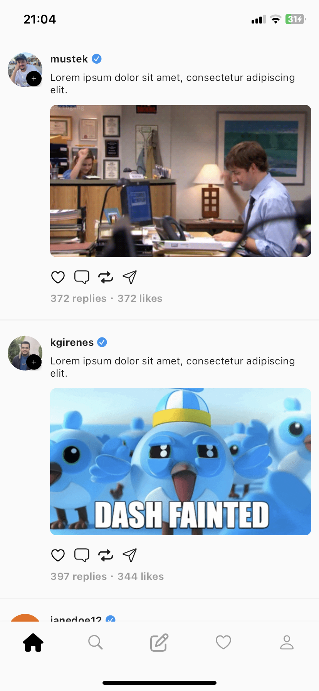
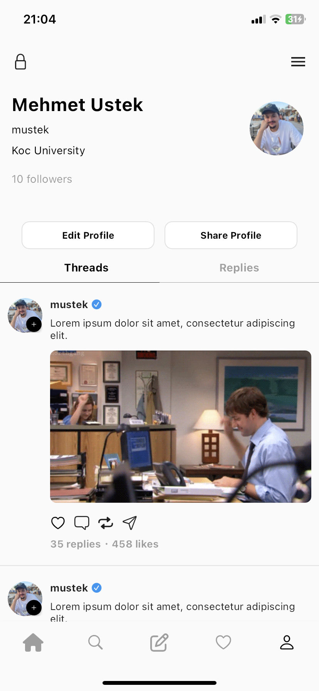
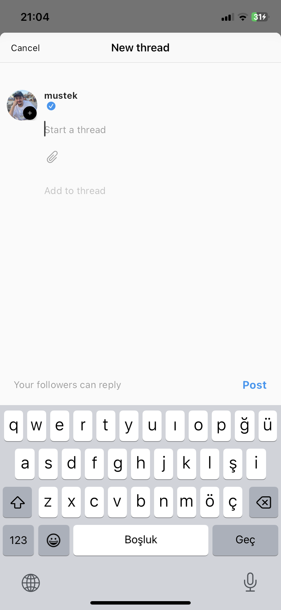
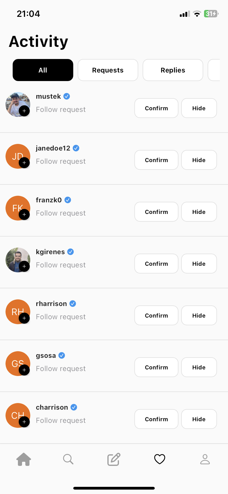
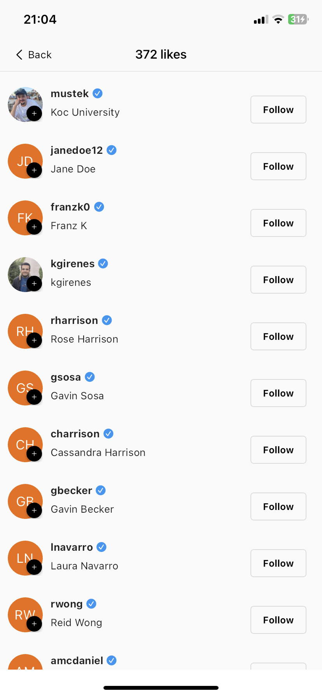
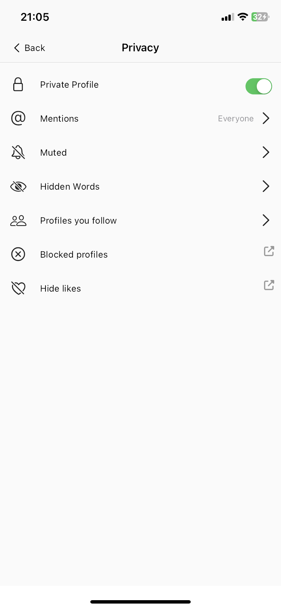
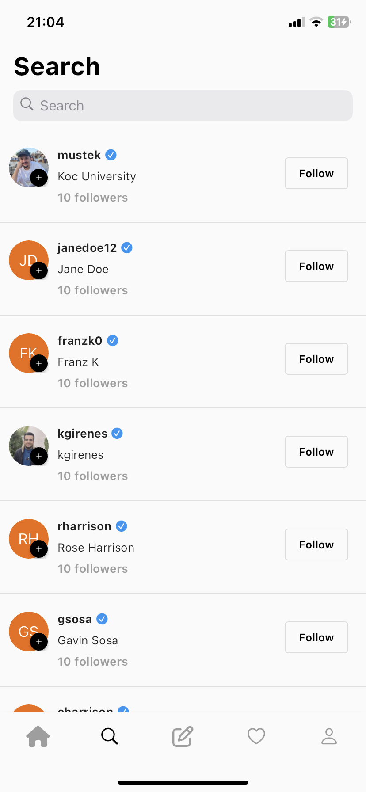
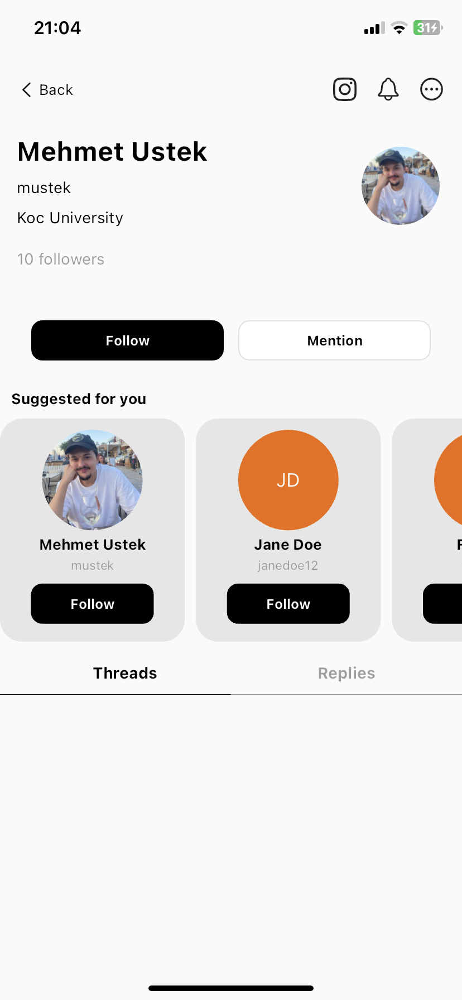

# threads_clone

This is my own implementation of Instagram Threads Frontend to reinforce my flutter/dart skills.

Still under development. 
▒▒▒▒▒▒▒▒▒▒ 0% 
█▒▒▒▒▒▒▒▒▒ 10% 
██▒▒▒▒▒▒▒▒ 20% 
███▒▒▒▒▒▒▒ 30% 
████▒▒▒▒▒▒ 40% 
█████▒▒▒▒▒ 50% 
██████▒▒▒▒ 60%  

## Images from the application on a physical device 

Home Page&emsp;&emsp;&emsp;&emsp;&emsp;&emsp;&emsp;&emsp;&emsp;&emsp;&emsp;Profile Page&emsp;&emsp;&emsp;&emsp;&emsp;New Thread Bottom Sheet 

 
Activity Page&emsp;&emsp;&emsp;&emsp;&emsp;&emsp;&emsp;&emsp;&emsp;&emsp;Likes Page&emsp;&emsp;&emsp;&emsp;&emsp;&emsp;&emsp;Privacy Options 

 
Search Page&emsp;&emsp;&emsp;&emsp;&emsp;&emsp;&emsp;&emsp;&emsp;&emsp;User Profile Page
 

  

## Running instructions

**To run the code, you should have:**  
Flutter (preferably or newer) 3.10.6 
Dart (preferably or newer) Dart 3.0.6 
Corresponding packages for android or ios development. (e.g Xcode devtools)  

**Install packages with:** 
!flutter pub get  
**Run the code(with a simulator or physical device connected):** 
!flutter run 
